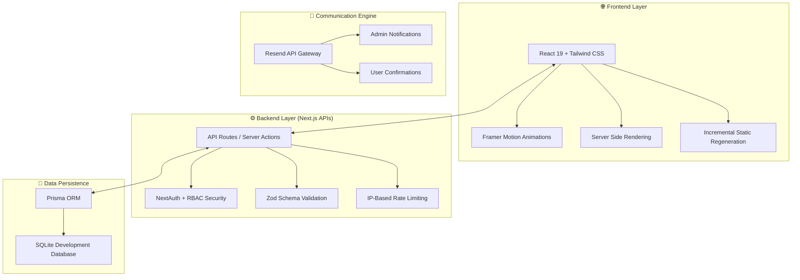

# 🛰️ Solitic.OS: Strategic Project Dossier

**Solitic.OS** is a premium, SaaS-grade consultancy and editorial platform built with high-fidelity architecture, designed specifically for professional consulting hubs and strategic leadership hubs.

---

## 🏛️ System Design & Architecture (Senior-Level)

The platform is architecturalized around a **Modern Serverless Monolith** pattern using **Next.js 15+ (App Router)**. This ensures ultra-fast delivery, extreme portability, and an editorial-first user experience.

### **🗺️ High-Level Infrastructure**



---

## 🍱 Technical Stack Breakdown

- **Framework**: **Next.js 15 (App Router)** - Leveraging Server Components for SEO and Client Components for premium interactivity.
- **Persistence**: **Prisma ORM + SQLite** - Ensuring 100% data integrity for leads and strategic content.
- **Authentication**: **NextAuth.js** - Secure, role-based access control (RBAC) via JWT and augmented TypeScript types.
- **Design System**: **Tailwind CSS + Shadcn UI** - A clinical, gold-and-charcoal visual palette designed for trust and authority.
- **Communication**: **Resend API** - Parallel email dispatch with branded HTML templates and auto-reply orchestration.
- **Security**: **Rate Limiting + Honeypot + Zod Validation** - Hardend against bot-driven spam and unauthorized access.

---

## 🏰 Administrative Command Center (`/admin`)

The Portal is your consultancy's "Intelligence Hub", allowing for full control over digital operations:

1.  **Lead Management**: Review incoming strategic inquiries, filter by company/sender, and respond with one click.
2.  **Editorial Engine**: A high-fidelity CMS for managing "Strategic Insight" blog posts, supporting rich-text and instant revalidation.

---

## 🚀 Getting Started & Operational Guide

### **1. Environment Configuration**
Ensure your `.env` file contains the required strategic keys:
```bash
DATABASE_URL="file:./dev.db"
NEXTAUTH_SECRET="your-high-security-secret"
RESEND_API_KEY="re_xxxxxxxxxxxxxx"
```

### **2. Deployment & Execution**
```bash
npm install        # Initialize global dependencies
npx prisma generate # 📀 Build data models
npm run dev        # 🛰️ Launch Strategic Development Server
```

### **3. Operational Diagnostics**
Perform a heartbeat check on your communication pipeline:
```bash
node scripts/heartbeat-resend.js
```

---

## 📈 Future Scaling Roadmap (Level 4 Audit)
- **Database Scalability**: Migrate from SQLite to **Supabase (PostgreSQL)** for distributed global data.
- **Asset Orchestration**: Integrate **Cloudinary** or **AWS S3** for large-scale strategic media.
- **Global Delivery**: Deploy via **Vercel Edge Functions** to ensure <100ms latency globally.

**Solitic.OS is architecturalized for elite performance and market authority. It stands as a production-ready foundation for professional digital excellence.**
